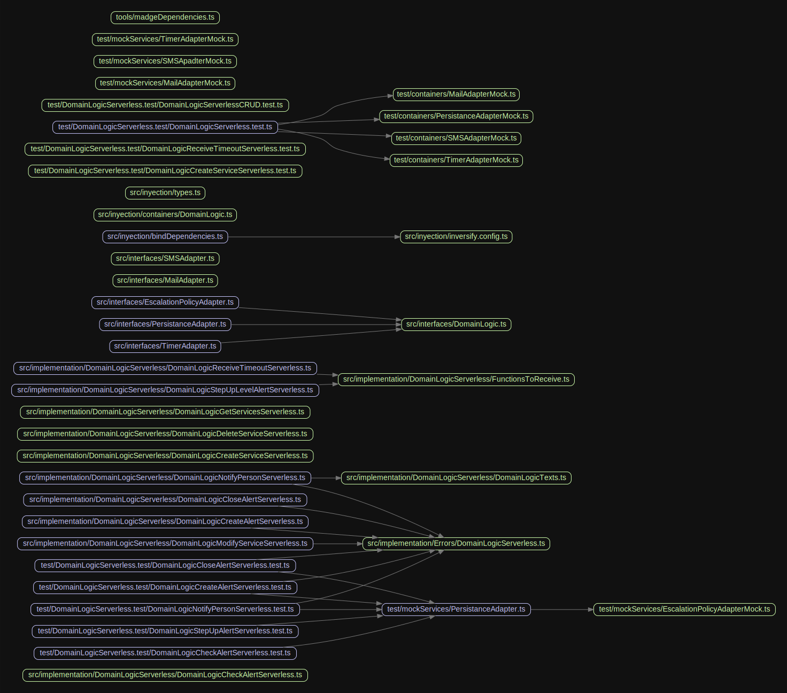
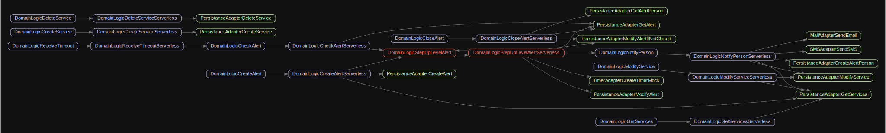
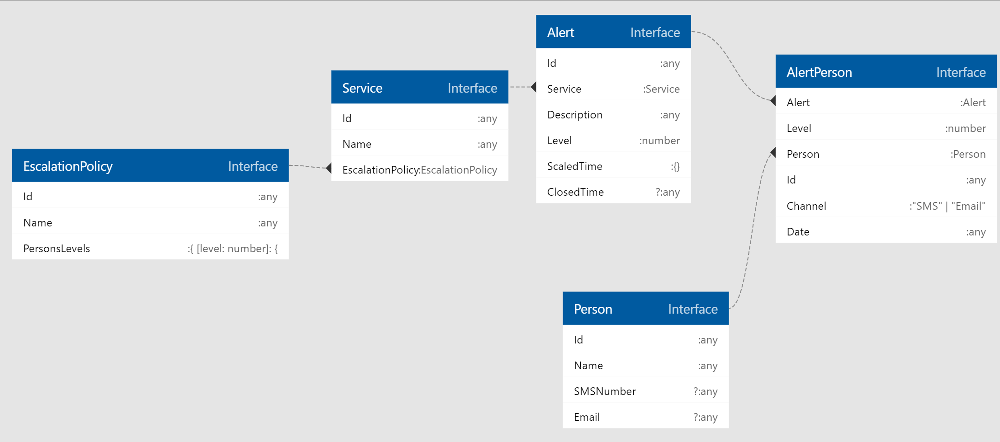

# Pager Service Problem 
This project is a code challenge from problem.
The problem could be found in `./problem`.

The first steps, was analize the problem. The notes about that could be found on file `./analysis.md`.

After that, I started a simple definicion of interfaces using Functional Programming.
To know how to create interfaces with Dependecy injection (and make a inversion of control) I used a [Inversify Recipe](https://github.com/inversify/InversifyJS/blob/master/wiki/recipes.md).

_I tweak the recipe to provide async resolving depencies and allow loop dependecies_

When I have the interfaces, I started to create a mocks for services I will consume like SMSAdapter.
After that, I startes to implement an implementation called `DomainLogicServerless` on `src/implementation/DomainLogicServerless`.
With the implementation I have created some containers to specify how will be the dependecy injection.

After create an implementation, I started to develop tests for every part of code to ensure all is fine.
I have used jest, becouse is very common and specially due code coverage is very easy to check.


<br>
<br>
<br>
Install dependecies with:

```
yarn
```

Run tests with:

```
yarn test
```

You will find a `test-report.html` with a brief details, but code coverage ar only print on console by now.

Also, you could debug any test with `yarn test-debug [FILENAME]`, running from a JavaScript Debug Terminal on VSCode:
```
yarn test-debug test/DomainLogicServerless.test/DomainLogicNotifyPersonServerless.test.ts
```

<br>

You could generate a diagram with :

```
yarn diagramDependencies
```

_Remeber to install [Graphviz with Choco](https://community.chocolatey.org/packages/Graphviz) to ensure is installed on path._

Result will be in `./tools/grpahs/*.svg`


### Project dependencies (from imports)


### Project dependencies (from dependency injection 💉)



<br>

# Implementation Details

The Domain Logic implementationjs definition are next ones:

### DomainLogicCreateServiceServerless, DomainLogicDeleteServiceServerless, DomainLogicGetServicesServerless, DomainLogicModifyServiceServerless

CRUD system to manage services.
A service will be an _application_ running that could notify alerts.

It should be accesible from Console Adapter.

### DomainLogicCheckAlertServerless
Check the alert after the timer for a reply.
### DomainLogicCloseAlertServerless
A user or an application tll the system the aplication works fine again.
This could be called from Console Adapter (User) or Alerting Adapter (Aplication has restore it self).

### DomainLogicCreateAlertServerless
An applications has a problem and tell is throw th Alerting Apater to this.

### DomainLogicNotifyPersonServerless
Internal method, Notify a person with SMS/Email provided about the problem received.
### DomainLogicReceiveTimeoutServerless
Generic method to delegate a timr to external system.
The method recied a delayed message and it will run a internal code.
Usefull to scale up a alert after 15 mins of no reply.

### DomainLogicStepUpLevelAlertServerless
Scales up th policy, notifying the persons in the new level.

### DomainLogicTexts
Aux file to provide text templates 

### FunctionsToReceive
Enumeration to know which functions could be called on a external timer.

<br>

# Entities


_[Generated with VCode extension vscode-ts-uml but types are mismatching](https://marketplace.visualstudio.com/items?itemName=myxvisual.vscode-ts-uml)_

### Escalation Policy
An escalation policy consits a name and a levels, every level has a group of diferents persons to be notified (every lev is a _Set_ of Persons)

### Service
A service is a system that could fail.
Has a Escaltion Policy associated.
Generates Alerts

### Alert
An alret belongs to a Service (Aplication) and informs about specific problem.
Every alret has a Level, that indicated which level has has been notifiied on the Escalation Policy associated on then Service.
The property Scaled time informs wich levels has benn notified and the timer Id created after then.

### AlertPerson
Every alert to every Person will be saved on this entity.

### Person
A person to be notifid about a problem.
Should appear in escalation policies and AlertPersons.

<br>
<br>
<br>
<br>

# TODO

- Bind dependencies with async import to load only modules required by the code (Serverless!)
- Separate interfaces, ERRORs, TYPES, bindinds from which are required by other modules and by the own implementation by DomainLogicServerless.
- Better test, integrations systems, etc...
- Intergrate in a Lerna like project.
<br>

<br>

<br>

________________

Cloned repo from: https://github.com/Envek/aws-sam-typescript-layers-example 

Original:
# typescript-jest-example
This is an example project for the following articles on [medium.com](https://medium.com):
- [Testing with JEST in TypeScript](https://itnext.io/testing-with-jest-in-typescript-cc1cd0095421)
- [Debug your tests in TypeScript with Visual Studio Code](https://bromix.medium.com/debug-your-tests-in-typescript-with-visual-studio-code-911a4cada9cd)

## Project setup
```
npm install
```

### Compile to typescript
```
npm run build
```

### Run tests
```
npm test
```
